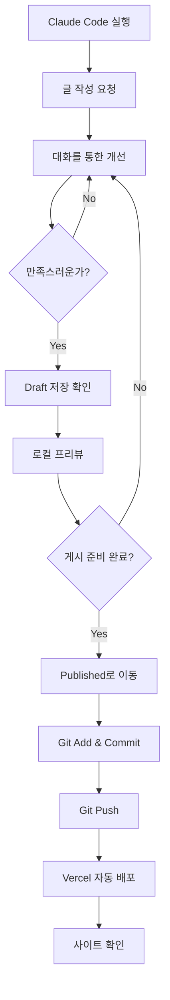

# Claude Code 워크플로우 가이드

이 문서는 Claude Code를 사용하여 기술 블로그를 작성하고 게시하는 전체 프로세스를 안내합니다.

---

## 📋 목차

1. [시작하기](#시작하기)
2. [블로그 글 작성 프로세스](#블로그-글-작성-프로세스)
3. [Draft에서 Published로 이동](#draft에서-published로-이동)
4. [배포 프로세스](#배포-프로세스)
5. [트러블슈팅](#트러블슈팅)

---

## 🚀 시작하기

### 사전 요구사항

- Node.js 18 이상
- pnpm 8 이상
- Claude Code CLI 설치
- Git 설정 완료

### 프로젝트 실행

```bash
# 프로젝트 디렉토리로 이동
cd technical-writing-with-claude

# 의존성 설치 (최초 1회)
pnpm install

# 개발 서버 실행
pnpm dev

# 브라우저에서 http://localhost:3000 접속
```

---

## ✍️ 블로그 글 작성 프로세스

### 1단계: Claude Code 실행

```bash
# Claude Code CLI 실행
claude code
```

### 2단계: 글 작성 요청

Claude에게 다음과 같이 요청하세요:

**예시 1: 기본 요청**
```
"React 19의 새로운 기능에 대한 기술 블로그 글을 작성해줘"
```

**예시 2: 상세 요청**
```
"Next.js 15의 Turbopack에 대한 튜토리얼을 작성해줘.
독자는 중급 개발자이고, 실습 가능한 예제 코드를 포함해줘."
```

**예시 3: 템플릿 기반 요청**
```
"/Users/.../templates/tutorial.mdx 템플릿을 참고해서
TypeScript 5.6의 새로운 기능에 대한 글을 작성해줘"
```

### 3단계: 대화를 통한 개선

Claude와 대화하며 내용을 보완하세요:

```
"코드 예제를 더 추가해줘"
"초보자도 이해할 수 있게 설명을 더 쉽게 풀어줘"
"이 부분에 다이어그램을 추가하면 좋을 것 같아"
"SEO를 위한 메타 설명도 최적화해줘"
```

### 4단계: MDX 파일 생성 확인

Claude가 파일을 생성하면 다음 위치에서 확인:

```
packages/posts/drafts/your-post-slug.mdx
```

### 5단계: 로컬에서 프리뷰

```bash
# 개발 서버가 실행 중이면 자동으로 새로고침됨
# http://localhost:3000 에서 확인
```

---

## 📤 Draft에서 Published로 이동

### 방법 1: 수동 이동 (간단)

```bash
# Draft → Published 이동
mv packages/posts/drafts/your-post.mdx packages/posts/published/

# 변경사항 확인
git status
```

### 방법 2: Claude에게 요청

```
"이 글을 published 폴더로 옮겨줘"
```

### Frontmatter 확인 사항

Published로 이동하기 전에 다음 항목을 확인하세요:

```yaml
---
title: "제목이 명확한가?"
description: "150자 이내의 설명이 있는가?"
date: "날짜가 올바른가?" (YYYY-MM-DD 형식)
tags: ["태그가", "적절한가?"]
category: "카테고리가 설정되었는가?"
author: "작성자 이름"
status: "published"  # draft → published로 변경했는가?
featured: false      # 추천 포스트로 표시할 경우 true
---
```

---

## 🚀 배포 프로세스

### 1단계: Git 스테이징

```bash
# 변경된 파일 확인
git status

# Published 포스트만 추가
git add packages/posts/published/your-post.mdx

# 또는 모든 변경사항 추가
git add .
```

### 2단계: 커밋

```bash
# 의미있는 커밋 메시지 작성
git commit -m "Post: React 19 새로운 기능 소개"

# 또는 Claude에게 요청
"이 변경사항을 커밋하고 푸시해줘. 적절한 커밋 메시지로"
```

### 3단계: Push

```bash
# 원격 저장소에 푸시
git push origin main

# Vercel이 자동으로 빌드 및 배포 시작
```

### 4단계: 배포 확인

1. Vercel 대시보드에서 빌드 로그 확인
2. 빌드 완료 후 배포 URL 확인
3. 실제 사이트에서 포스트 확인

**예상 배포 시간**: 2-5분

---

## 🔄 전체 워크플로우 요약



---

## 🛠️ 트러블슈팅

### Q1: 포스트가 목록에 보이지 않아요

**확인 사항**:
1. `status: "published"` 로 설정했는지 확인
2. 파일이 `packages/posts/published/` 안에 있는지 확인
3. Frontmatter 형식이 올바른지 확인 (YAML 문법)
4. 개발 서버 재시작: `pnpm dev` 다시 실행

### Q2: 빌드 에러가 발생해요

```bash
# 에러 확인
pnpm build

# 일반적인 원인:
# - Frontmatter 형식 오류
# - MDX 문법 오류 (닫히지 않은 태그 등)
# - 이미지 경로 오류
```

**해결 방법**:
```
"빌드 에러가 발생했어. 다음 에러 메시지를 확인하고 수정해줘:
[에러 메시지 붙여넣기]"
```

### Q3: 코드 하이라이팅이 안 돼요

**확인 사항**:
```mdx
# 언어 지정 확인
​```typescript  ✅
​```ts         ✅
​```          ❌ (언어 미지정)
```

### Q4: 이미지가 표시되지 않아요

**이미지 경로**:
```mdx
# Public 폴더 사용


# 절대 경로는 /public을 기준으로 함
apps/blog/public/images/example.png → /images/example.png
```

### Q5: 태그 페이지가 404 에러

**원인**: 태그 페이지는 Phase 5에서 구현 예정

**임시 해결**: 태그 링크는 표시되지만 아직 동작하지 않습니다.

---

## 💡 베스트 프랙티스

### 1. 파일명 규칙

```bash
# Good ✅
react-19-new-features.mdx
debugging-nextjs-errors.mdx
typescript-best-practices.mdx

# Bad ❌
React 19.mdx              # 공백 사용
react_19.mdx              # 언더스코어 사용
리액트19.mdx              # 한글 사용
```

### 2. Frontmatter 작성 팁

```yaml
# 제목: 50자 이내, 키워드 포함
title: "Next.js 15 Turbopack 완벽 가이드"

# 설명: 120-150자, 검색 최적화
description: "Next.js 15의 Turbopack을 실전 프로젝트에 적용하는 방법을 단계별로 알아봅니다. 성능 개선 사례와 마이그레이션 팁 포함."

# 태그: 3-5개, 구체적으로
tags: ["Next.js", "Turbopack", "Performance", "Migration"]

# 카테고리: 1개, 일관성 유지
category: "Frontend"
```

### 3. 콘텐츠 구조

```mdx
# 명확한 제목 (H1은 자동 생성되므로 H2부터 시작)

## 개요
- 무엇을 다루는가
- 왜 중요한가
- 누구를 위한 글인가

## 본문
- 단계별 설명
- 코드 예제
- 실습 가이드

## 결론
- 핵심 요약
- 다음 단계
- 참고 자료
```

### 4. 코드 블록 팁

```mdx
# Before/After 비교
​```typescript
// Before
const data = await fetch('/api/data').then(res => res.json())

// After
const data = await (await fetch('/api/data')).json()
​```

# 파일명 표시
​```typescript:app/page.tsx
export default function Page() {
  return <div>Hello</div>
}
​```
```

---

## 📚 다음 단계

- [프롬프트 가이드](./prompts.md) - 효과적인 프롬프트 작성법
- [템플릿 사용하기](../../packages/posts/templates/README.md) - MDX 템플릿 활용
- [Technical Writing Guide](./technical-writing-guide.md) - 기술 문서 작성 원칙

---

**마지막 업데이트**: 2025-10-16
**작성자**: Claude Code
**버전**: 1.0
